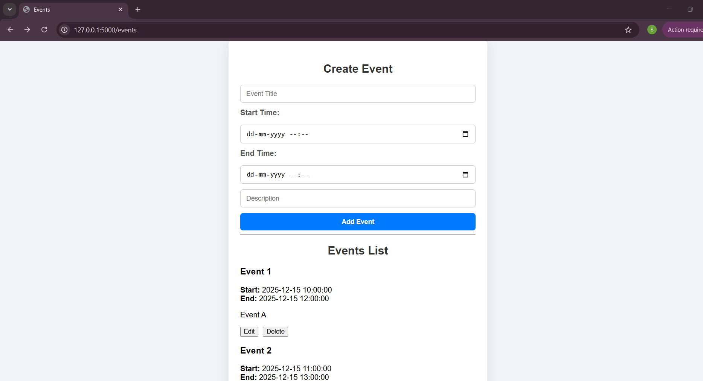
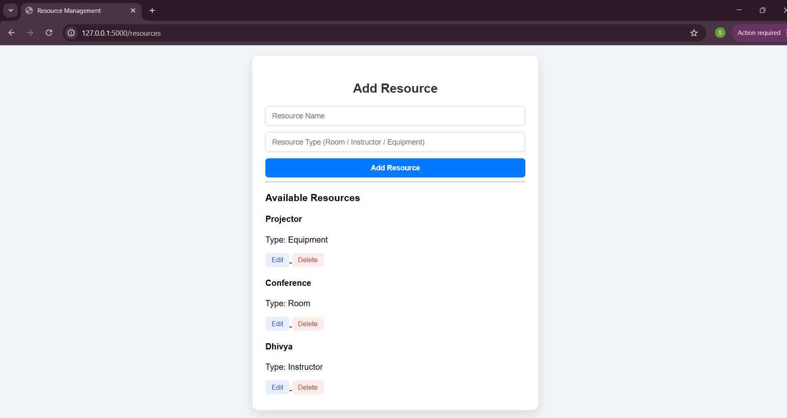
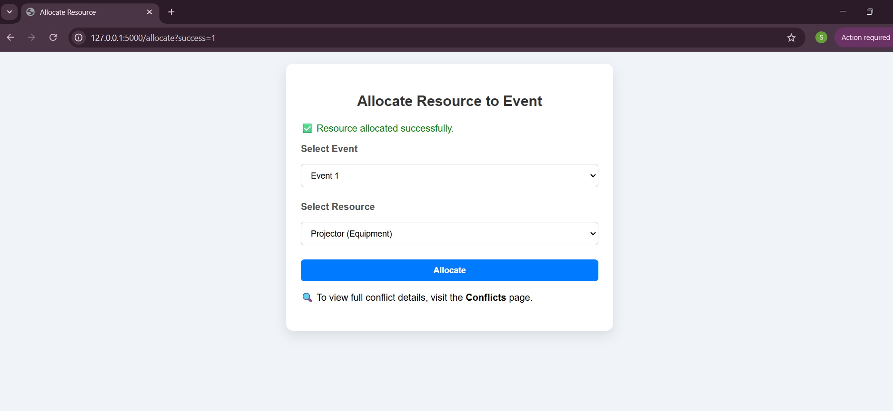
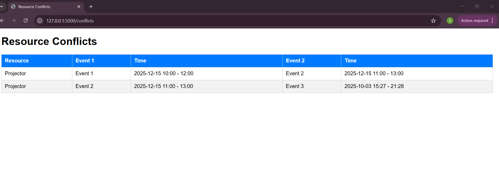
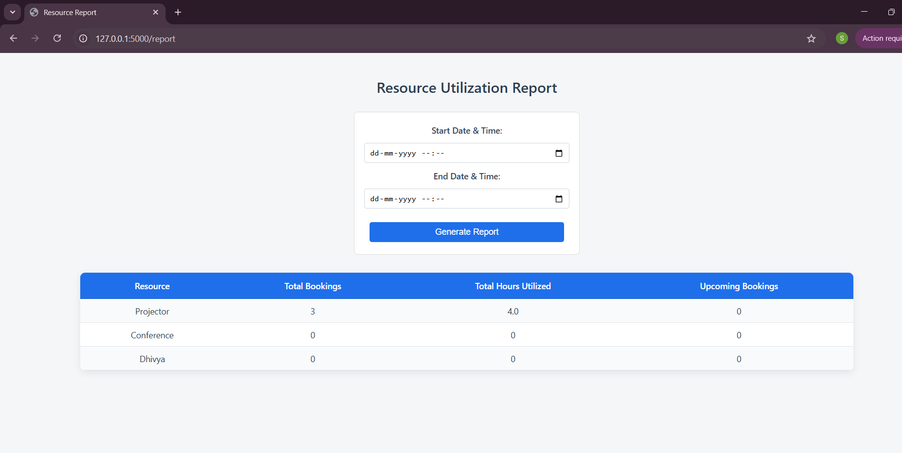

# 📅 Event Scheduler with Resource Allocation (Flask)

A Flask-based web application to manage events, allocate shared resources, detect scheduling conflicts, and generate utilization reports.

---

## 🚀 Features

* ✅ Create, edit, and delete **Events**
* ✅ Create, edit, and delete **Resources**
* ✅ Allocate resources to events
* ❌ Automatic **conflict detection** for overlapping event schedules
* 📊 Resource utilization report (total hours, events, upcoming events)
* 🔄 Form reset after refresh (no repeated conflict messages)
* 🗂 SQLite database using SQLAlchemy ORM

---

## 🛠️ Tech Stack

* **Backend:** Flask (Python)
* **Database:** SQLite
* **ORM:** Flask-SQLAlchemy
* **Frontend:** HTML, Jinja2, CSS, Bootstrap

---

## 📂 Project Structure

```
event_scheduler/
│
├── app.py
├── models.py
├── events.db
│
├── templates/
│   ├── base.html
│   ├── events.html
│   ├── resources.html
│   ├── allocate.html
│   ├── conflicts.html
│   └── report.html
│
├── static/
│   └── style.css
│
└── README.md
```

---

## ⚙️ Installation & Setup

### 1️⃣ Clone the Repository

```bash
git clone https://github.com/your-username/event_scheduler.git
cd event_scheduler
```

---

### 2️⃣ Create Virtual Environment (Recommended)

```bash
python -m venv venv
```

Activate it:

**Windows**

```bash
venv\Scripts\activate
```

**Mac / Linux**

```bash
source venv/bin/activate
```

---

### 3️⃣ Install Dependencies

```bash
pip install flask flask_sqlalchemy
```

---

### 4️⃣ Run the Application

```bash
python app.py
```

The app will run at:

```
http://127.0.0.1:5000/
```

---

## 🌐 Application Routes

| Route        | Description                  |
| ------------ | ---------------------------- |
| `/events`    | Create and manage events     |
| `/resources` | Create and manage resources  |
| `/allocate`  | Allocate resources to events |
| `/conflicts` | View all detected conflicts  |
| `/report`    | Resource utilization report  |

---

## ⚠️ Conflict Detection Logic

A conflict occurs when:

* The **same resource** is assigned to
* **Two different events**
* With **overlapping start and end times**

Conflicts are:

* Prevented during allocation
* Shown immediately after form submission
* Automatically cleared on page refresh

---

## 📸 Screenshots & Demo (Mandatory)

Add the following before submission:

* 📷 Screenshots of:

  * Event management
  * Resource allocation
  * Conflict detection
  * Reports
* 🎥 Screen-recorded demo video

Example folder:

```
screenshots/
├── events.png
├── resources.png
├── allocate.png
├── conflicts.png
└── report.png
```


### Screenshots and Demo
Events:  
  
Resources :  
  
Allocate :  
  
Conflicts:  
  
Report :  
  

### Video Demo
[Watch Full Demo](https://drive.google.com/file/d/1bSqvKHUmJjJWEuS2asw0yJnvTELpTwLZ/view?usp=sharing)  or (screenshots/video.mp4)

---

## 👩‍💻 Author

**S Dhivya**
Flask Event Scheduler Project

---

